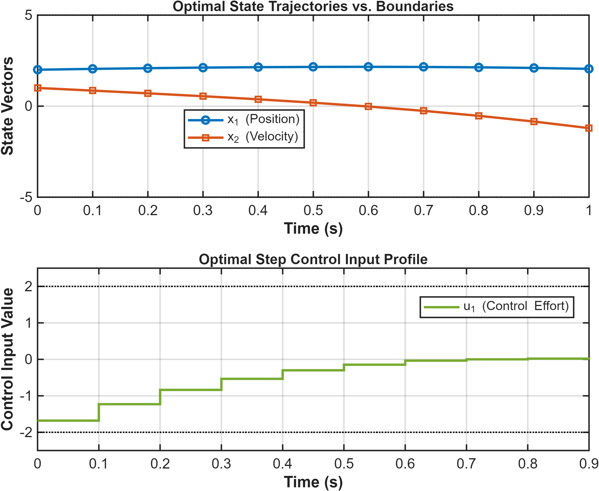
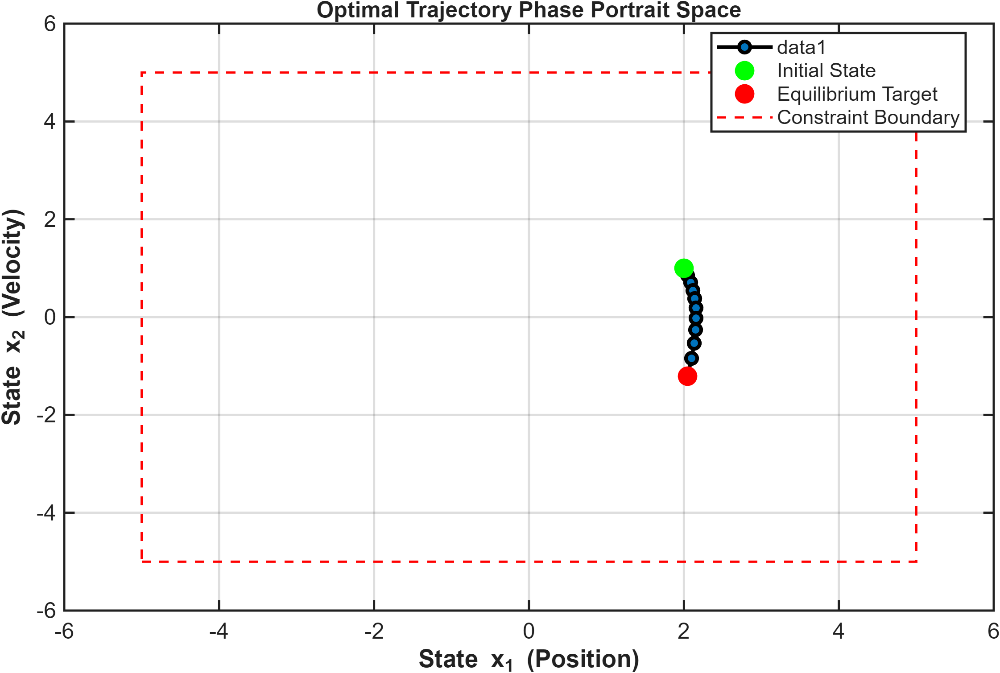
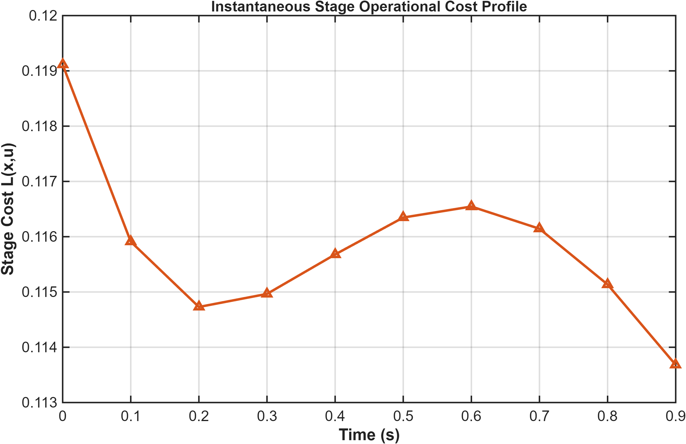
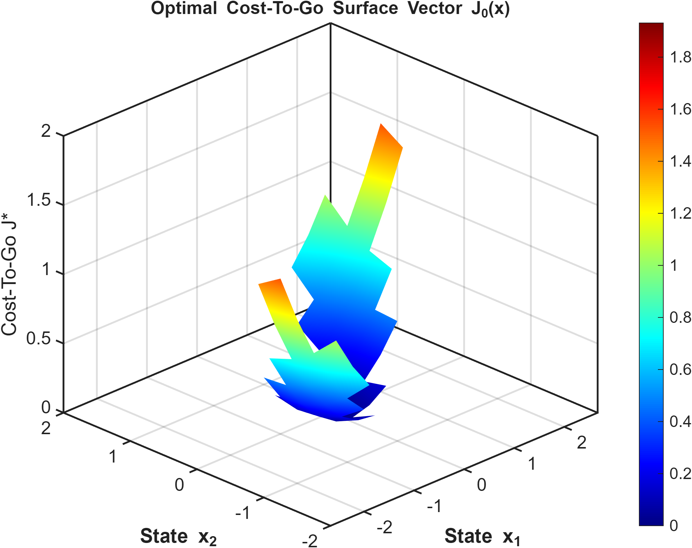
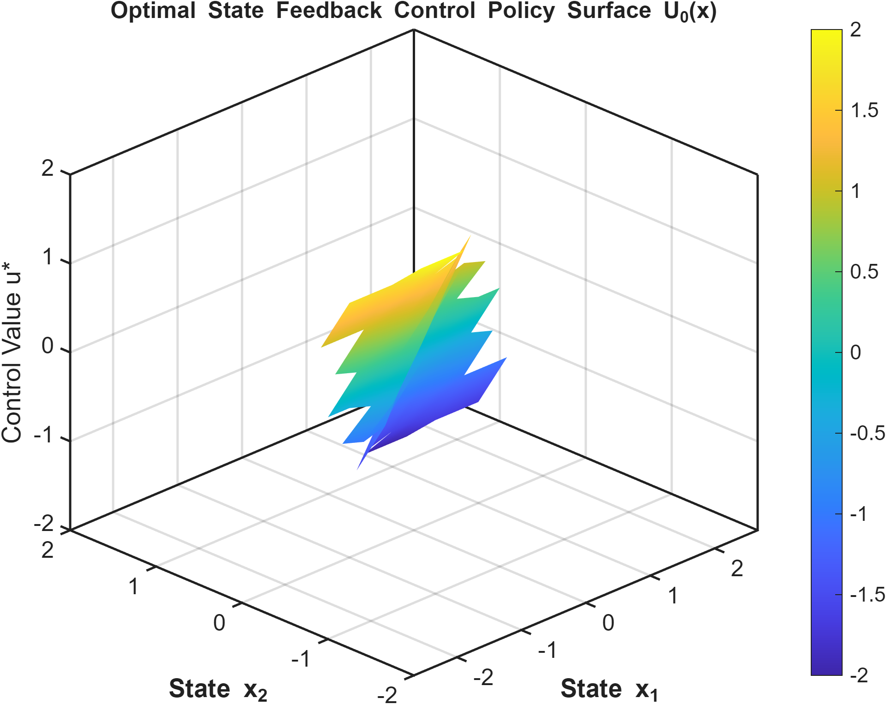

# Constrained Optimal Control using Dynamic Programming

## Overview

This project implements a Bellman-based Dynamic Programming framework for solving finite-horizon constrained optimal control problems. The implementation computes globally optimal control policies by recursively evaluating the cost-to-go function over discretized state and input spaces while enforcing state and control constraints.

Unlike problem-specific implementations, this framework is designed for generalized **n-dimensional state spaces** and **m-dimensional input spaces**, making it reusable for a wide range of deterministic optimal control problems.

---

## Problem Statement

Given a discrete-time linear system

**x(k+1) = Ax(k) + Bu(k)**

determine the optimal control sequence that minimizes a quadratic performance index while satisfying prescribed state and input constraints over a finite prediction horizon.

The optimization objective is to compute the globally optimal control policy using Bellman's Principle of Optimality.

---

## Mathematical Background

The finite-horizon optimal cost is defined as

**J = Σ [xᵀQx + uᵀRu] + xᵀ(N)Gx(N)**

where

- **Q** – State weighting matrix
- **R** – Control weighting matrix
- **G** – Terminal cost matrix

The Dynamic Programming recursion is given by

**Jₖ(x) = minᵤ { L(x,u) + Jₖ₊₁(f(x,u)) }**

where

- **L(x,u)** is the stage cost.
- **Jₖ(x)** is the optimal cost-to-go.
- **f(x,u)** represents the system dynamics.

The implementation computes the optimal value function through backward recursion and reconstructs the optimal trajectory using forward simulation.

---

## Features

- Generalized **n-state, m-input** Dynamic Programming framework
- Bellman backward recursion
- Multi-dimensional state-space discretization
- Multi-dimensional input-space discretization
- State and input constraint handling
- Cost-to-go interpolation using `griddedInterpolant`
- Forward optimal trajectory simulation
- Automatic generation of publication-quality figures

---

## MATLAB Implementation

The project is organized into modular MATLAB files.

```text
02_Dynamic_Programming/
│
├── main.m
├── solveDP_General.m
├── plotResults.m
├── README.md
└── images/
```

### File Description

**main.m**
- Defines the system model, constraints, and optimization parameters.
- Executes the Dynamic Programming solver.
- Generates and exports all simulation figures.

**solveDP_General.m**
- Constructs generalized state and input grids.
- Performs Bellman backward recursion.
- Computes optimal cost-to-go functions.
- Generates optimal feedback policies.
- Simulates the optimal closed-loop trajectory.

**plotResults.m**
- Produces publication-quality visualizations.
- Automatically exports all figures to the `images` directory.

---

## Simulation Results

### Optimal State and Control Trajectories



The optimal controller drives the system while satisfying all prescribed state and input constraints.

---

### State-Space Phase Portrait



The phase portrait illustrates the evolution of the optimal state trajectory within the admissible operating region.

---

### Running Cost



The instantaneous quadratic cost demonstrates the evolution of the optimal stage cost throughout the prediction horizon.

---

### Optimal Value Function



The value function surface represents the optimal cost-to-go over the discretized state space obtained through Bellman recursion.

---

### Optimal Control Policy



The optimal feedback policy maps every admissible state to its corresponding optimal control input.

---

## Key Observations

- Bellman backward recursion guarantees globally optimal solutions over the discretized search space.
- State and control constraints are explicitly enforced throughout the optimization process.
- Multi-dimensional interpolation enables efficient approximation of the value function between grid points.
- The generalized implementation can be extended to higher-dimensional optimal control problems with minimal structural modifications.
- The framework separates optimization, simulation, and visualization into reusable modules.

---

## Software Requirements

- MATLAB
- Control System Toolbox

---

## How to Run

1. Open the project folder in MATLAB.
2. Ensure the Control System Toolbox is available.
3. Execute

```matlab
main
```

The script automatically:

- Builds the Dynamic Programming grid.
- Computes the optimal value function.
- Generates the optimal policy.
- Simulates the optimal trajectory.
- Exports all figures to the `images` folder.

---

## References

1. Richard Bellman, *Dynamic Programming*
2. Dimitri P. Bertsekas, *Dynamic Programming and Optimal Control*
3. David G. Luenberger, *Optimal Control Theory*
4. Donald E. Kirk, *Optimal Control Theory: An Introduction*

---

## Learning Outcomes

This project demonstrates practical implementation of

- Dynamic Programming
- Bellman's Principle of Optimality
- Constrained Optimal Control
- Value Function Approximation
- Optimal Policy Generation
- Multi-Dimensional Interpolation
- Numerical Optimal Control
- MATLAB Scientific Computing